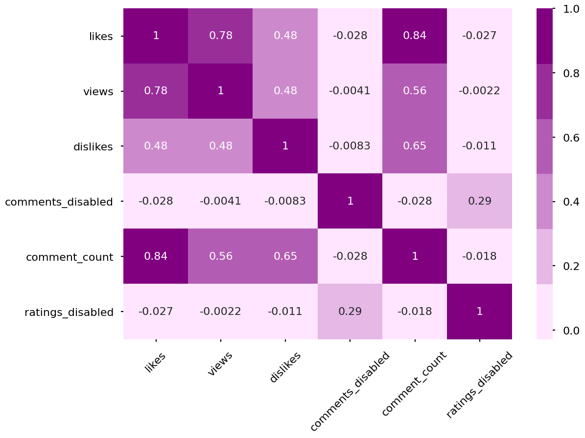

# Description
- I have a data set of 800,000 records that contains information on YouTube videos.
- This information ranges from the title, publishing date, views, comment count, likes, dislikes, and more.
- I will try to use the given features to predict attributes such as likes.

# EDA (WIP)
Considering the first task I have in mind is to predict likes, that is going to require some sort of regression model.
Let's start off by seeing the pearson correlations between our numeric features to get a rough idea of the data I'm working with.  

  

- Views and comment count seems to strongly correlate with the number of likes. 
    - Especially comment count  
      
Initially, it was my prediction that comment count would correlate the strongest to likes. Views alone do not mean people liked the video  

I noticed that comment_count has some slight correlation with dislikes and views. I don't think that dislikes and views would be accurate enough in predicting comment count, so multicollinearity is not an issue at the moment.

