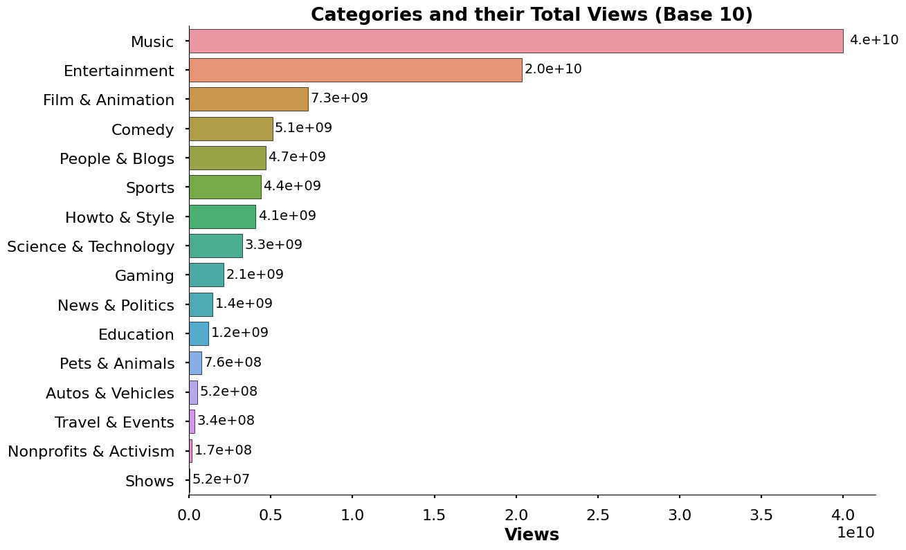
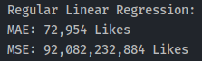
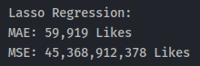

# Description
- I have a data subset of 40,000 records from a data set of 800,0000 records that contains information on YouTube videos.
- This information ranges from the title, publishing date, views, comment count, likes, dislikes, and more.
- I will try to use the given features to predict attributes such as likes.

# EDA (WIP)

## Numerical Data Distribution

Each of the columns seems to have a nice and normal distribution with no outliers.
## Looking at the Data on Likes

### Likes and Categories

I was surprised in seeing that Gaming wasn't higher up on the list.  

### Like Distribution in Categories

  
It's interesting to see what video types usually do well. All of the videos under the 'Shows' category have a high amount of likes and are usually consistent in the amount of likes they receive. 

## Looking at Data on Views

### Views and Categories

Interesting to me that some videos in a less popular category will have a better view to like ratio than others. For example, People & Blog videos get a better view to like ratio than a category like Film & Animation despite getting 3 million more views total.

### View Distribution in Categories

I still find it very interesting that the Shows category has a very consistent viewership count. I also find it interesting that comedy has the trending video with the highest views in comparison to a category like Music.

## Comment Data

Kind of expected the order of the categories to be the same as the previous ones. Although it is clear there is a linear trend between comments, likes, and views.

It's weird that there are a lot of outliers towards the lower end of comments, but hardly any outliers on the higher end of the comment count scale.

## Correlations

Considering the first task I have in mind is to predict likes, that is going to require some sort of regression model.
Let's start off by seeing the pearson correlations between our numeric features to get a rough idea of the data I'm working with.  

  

- Views and comment count seems to strongly correlate with the number of likes. 
    - Especially comment count  
      
Initially, it was my prediction that comment count would correlate the strongest to likes. Views alone do not mean people liked the video  

I noticed that comment_count has some slight correlation with dislikes and views. I don't think that dislikes and views would be accurate enough in predicting comment count, so multicollinearity is not an issue at the moment.

# Predictive Modeling
Here I will use different machine learning algorithms to predict different attributes of a video  
Due to how the data was very spread out, I used the Log conversions of the different features in my data frame.  
The standard procedure I will be following for the models except the basic linear regression is 
## Predicting Likes

First I will try just straight linear regression to get a base value to see how the other models differ

### Linear Regression
The features I chose were views, dislikes, comments_disabled, comment_count, and ratings_disabled  

  
So on average, the model is off by about 76227 likes. This is pretty good actually.  
I expected this to be the case because the features I was using showed a strong correlation with the target label in the correlation matrix shown earlier.

### Ridge Regression
I decided to use Ridge Regression next because from observing the correlation matrix, I was worried that there could be some slight multicollinearity (comment_count, dislikes, views)
I did a Grid Search of alpha values from 0.01 to 20.0 with k-fold cross validation of k = 5.  

  
So the results actually improved, but only by around 1000 likes. Still a significant improvement though.

### Lasso Regression
Some of the features in the correlation matrix did not seem to matter much, so I thought about using Lasso Regression to see if that would improve my predictions
I did a Grid Search of alpha values from 0.01 to 20.0 with k-fold cross validation of k = 5.  
  
This is really interesting because I have improved my predictions by about ~12,000 likes. I believe this is the case because some of my feature variables that didn't correlate much were penalized by the Lasso Regression algorithm.

### ElasticNet Regression
I followed the same param tuning procedures as I did for the previous algorithms.  
  
It seems that the results did not improve from Lasso Regression.
